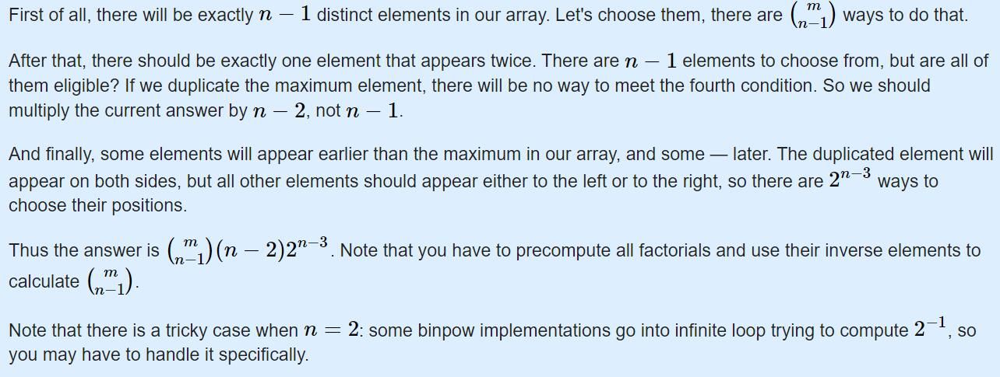

# cf_edu_83_div2 
[contest_link](https://codeforces.com/contest/1312)

1. [TOC]
{:toc}

## A *easy-*

### *solution*

### *code:*

```cpp
#include<bits/stdc++.h>
using namespace std;

int main(){
    int T;
    cin>>T;
    int n, m;
    while(T--){
        scanf("%d%d", &n, &m);
        if(n % m == 0) printf("YES\n");
        else printf("NO\n");
    }
    return 0;
}
```

## B *easy+*

### *solution*：思路想到很简单，直接降序可以保证一定符合条件。
### *code*:

```cpp
#include<bits/stdc++.h>
using namespace std;
#define N 110
int a[N], n;
void solve(){
    for(int i = 1; i <= n; i++) scanf("%d", &a[i]);
    sort(a + 1, a + 1 + n);
    for(int i = n; i >= 1; i--){
        if(i == 1) printf("%d\n", a[i]);
        else printf("%d ", a[i]);
    }
    return ;
}
int main(){
    int T;
    cin>>T;
    while(T--){
        scanf("%d", &n);
        solve();
    }
    return 0;
}
```

## C *medium-*

### *solution:* 

类似k进制数思维理解，对于k的任意次幂只能用一次，那么相当于对于a[1...n]中同一位下的值最多有一个非零，且不能超过1。
ps.这次翻车主因就是我tm写嗨了没写不能超过1，最坑的是当时提交居然过了，cf edu场不存在pretest的，我是佛了，比赛结束后12h内被hack了才发现这个问题。

### *code:*

```cpp
#include<bits/stdc++.h>
using namespace std;
#define N 110
typedef long long LL;
LL n, k, a[N], b[N];
void init(){
    scanf("%lld%lld", &n, &k);
    for(int i = 1; i <= n; i++) scanf("%lld", &a[i]);
    memset(b, 0, sizeof(b));
    return ;
}
bool check(){
    for(int i = 1; i <= n; i++){
        if(a[i] > 0) return true;
    }
    return false;
}
void solve(){
    while(check()){
        for(int i = 1; i <= n; i++){
            b[i] = a[i] % k; a[i] /= k;
        }
        int cnt = 0;
        for(int i = 1; i <= n; i++){
            if(b[i] != 0) ++cnt;
            if(b[i] > 1) cnt++;
        }
        if(cnt > 1){
            printf("NO\n"); return ;
        }
    }
    printf("YES\n");
    return ;
}
int main(){
    int T;
    cin>>T;
    while(T--){
        init();
        solve();
    }
}
```

## D *medium*

### *solution:*
自己写的比较麻烦，考虑情形太散了，标解很简洁也更高效。


### *code:*

```cpp
#include<bits/stdc++.h>
using namespace std;
#define M 998244353
#define N 200020
typedef long long LL;
LL f[N];
LL n, m;

LL exgcd(LL a, LL b, LL& x, LL& y){
    LL d = a;
    if(b != 0){
        d = exgcd(b, a % b, y, x);
        y -= (a / b) * x;
    }
    else{
        x = 1; y = 0;
    }
    return d;
}

LL inv(LL a){
    LL x, y;
    exgcd(a, M, x, y);
    return (M + x % M) % M;
}

LL work(LL x, LL& e){
    e = 0;
    if(x == 0) return 1;
    LL res = work(x / M, e);
    e += x / M;
    if(x / M % 2 != 0) return res * (M - f[x % M]) % M;
    return res * f[x % M] % M;
}
LL calc(LL x, LL k){
    if(x < 0 || k < 0 || x < k) return 0;
    LL e1, e2, e3;
    LL a1 = work(x, e1);
    LL a2 = work(k, e2);
    LL a3 = work(x - k, e3);
    // cout<<e1<<' '<<e2<<' ' <<e3<<endl;
    if(e1 > e2 + e3) return 0;
    return a1 * inv(a2 * a3 % M) % M;
}
void init(){
    f[1] = 1;
    for(LL i = 2; i <= m; i++){
        // cout<<f[i - 1]<<endl;
        f[i] = i* f[i - 1];
        f[i] %= M;
        // cout<<i<<' '<<f[i]<<endl;
    }
    return ;
}
void solve(){
    // cout<<calc(0, 0)<<endl;
    LL ans = 0;
    if(n == 2){
        printf("0\n"); return ;
    }
    LL t = 0;
    for(LL x = n - 1; x <= m; x++){
        t += calc(x - 1, n - 2) * (n - 2) % M;
    }
    t %= M;
    // cout<<t<<endl;
    for(LL i = 2; i <= n - 1; i++){
        ans = (ans + (t * calc(n - 3, i - 2) % M)) % M;
    }
    printf("%lld\n", ans);
    return ;
}
int main(){
    scanf("%lld%lld", &n, &m);
    init();
    solve();
    return 0;
}
```

## E

### *solution:* 

区间DP：
设 dp[i][j]为区间[i,j]合并后的最短数列的长度，因为题目中的合并放到数组中不太好实现，我们等加成区间赋值就可以了，如果遇到需要将区间 [i,k] 与区间 [k+1,j] 合并，可以直接将 [i,j] 赋值，详见代码。
（ reference： https://blog.csdn.net/qq_45458915/article/details/104766122?fps=1&locationNum=2 ）

### *code:*

```cpp
#include<bits/stdc++.h>
using namespace std;
#define N 550

// a[i] 原数组
// dp[i][j] 区间[i,j]最终可以合并至dp[i][j]个数 ==>> dp[1][n] 即为所求
// val[i][j] dp[i][j] = 1 时 [i,j]区间所能合并出的那个值
int a[N], dp[N][N], val[N][N], ans[N], n;
void init(){
    scanf("%d", &n);
    for(int i = 1; i <= n; i++) scanf("%d", &a[i]);
    return ;
}

void solve(){
    // 预处理
    for(int i = 1; i <= n; i++) val[i][i] = a[i];
    for(int i = 1; i <= n; i++){
        for(int j = i; j <= n; j++){
            dp[i][j] = j - i + 1;
        }
    }
    // 计算val[i][j], dp[i][j]
    // 区间DP：d枚举区间长度 区间为[l,r]
    for(int d = 1; d < n; d++){
        for(int l = 1; l + d <= n; l++){
            int r = l + d;
            for(int k = l; k < r; k++){
                dp[l][r] = min(dp[l][r], dp[l][k] + dp[k + 1][r]);
                if(dp[l][k] == 1 && dp[k + 1][r] == 1 && val[l][k] == val[k + 1][r]){
                    dp[l][r] = 1; val[l][r] = val[l][k] + 1;
                }
            }
        }
    }
    printf("%d", dp[1][n]);
    return ;
}
int main(){
    init();
    solve();
    return 0;
}
```

